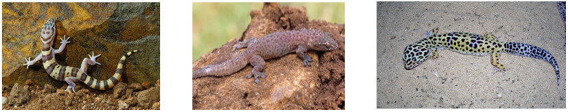
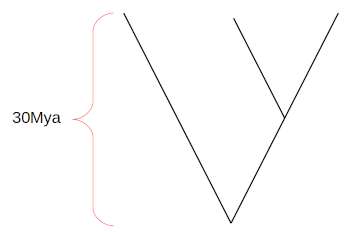

# Practical on genetic drift, mutation and divergence

You are interested in the divergence time of three species of gecko. 
You obtained some samples and sequenced a fraction of their genome.
Specifically you have access to 20kbp for 10 individuals from each species of:

* western banded gecko

* bent-toed gecko

* leopard gecko

Therefore, you have data for 30 diploid individuals, 10 for each species.
The genomic data is stored in three .csv files, each one named after its species: `western_banded_gecko.csv`, `bent-toed_gecko.csv`, `leopard_gecko.csv`. 
Obtain an estimate of the divergence time between bent-toed and western banded geckos assuming that:

* these three species have a most recent common ancestor 30 million years ago;

* the topology of the species tree is:

A suggestion would be to calculate the genetic divergence for each pair of species to assign leaves to the proposed topology.

Bonus question: what is the divergence between the leopard gecko and the ancestor of the western banded and bent-toed geckos?
How would you calculate this value?

